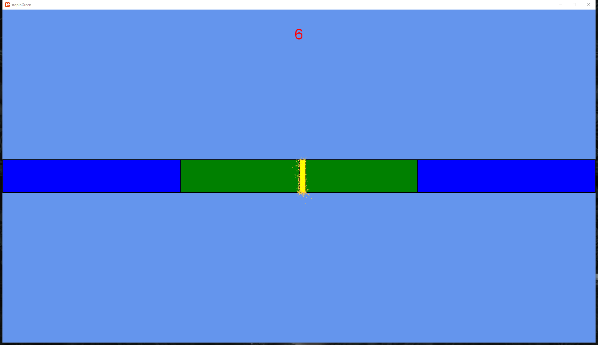

# stopInGreen
 This is a mini MonoGame. Your goal is to stop the yellow bar in green area. At the begining, the green area is wide, and then everytime you stop the yellow bar in green, the green area will shrink until the size of green area is minimal.
 
 How to play: Press space bar to stop the yellow moving bar
 
 Feature: High score board
 
 
